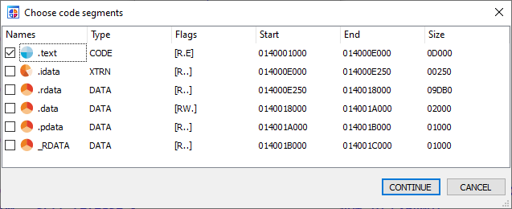
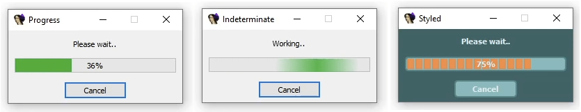

## IDA Pro Plugin Support Libraries

By Kevin Weatherman, Updated 2025 for IDA 9, [Github](https://github.com/kweatherman/IDA_Support)

#### Utility and support libraries for IDA Pro C/C++ plugins.

* **Utility**: *Utility.h* & *Utility.cpp*, common utility support needed for my plugins. String format, time stamp, exception, platform, etc., support.

------

* **IDA_OggPlayer:** Ogg Vorbis audio file format player from memory I use to indicate a long running plugin completion.  
                                                          A wrapper around [stb_vorbis](http://nothings.org/stb_vorbis/). Allows embedding of audio files that are smaller in size from compression vs raw WAV files. 
							  
------
* **IDA_SegmentSelect:** Custom segment select widget. To solve the problem where the IDA SDK [ask_seg()](https://cpp.docs.hex-rays.com/kernwin_8hpp.html#ac70e33ed6d6d79d08a8f925a182a02e8) function only allows for a single selection, where this one allows multiple selections that returns a list.

##### Example

------

* **IDA_WaitEx:** Custom wait box widget. A replacement for the default IDA API [show_wait_box()](https://cpp.docs.hex-rays.com/kernwin_8hpp.html#a325acb9c1c1713846df9797e2a1364a3) that solves a lot of issues of it, like lacking any kind of progress feedback, unable to minimize IDA while the wait box is, up, etc. Plus facilitates some extra UI pizzazz vs the default generic looking widget.

##### Examples

------

### Using

For any or all of the library projects, add the "include" folder, the single header file and the "lib" folder to your Visual Studio 2022 IDA Pro 9 plugin project. Some example projects and/or see usage in some of my plugin projects for usage examples.   
You don't need to install the Qt development environment just to use the libraries since they are prebuilt and the IDA SDK already includes the necessary Qt libraries.

------

### Building

*IDA_OggPlayer* has no other dependencies other than the IDA SDK headers and libs. While the others will require a Qt development environment
if you wish to modify/build them.

* Built using Visual Studio 2022.
* Qt version 5.15.2. Although as of at least IDA 9.0.2 the actual Qt version used is 5.15.3.0, the differences would only be in the headers since the Qt libs ultimately used are the ones from the IDA SDK. The Qt online installer only includes the 5.15.2 version under "Archive".  
  Note: All you really need when installing is the "Qt Design Studio" for editing widgets/dialogs, Qt 5.15.2 -> MSVC 2019 64bit,  "Qt Creator", and the "Qt Tools Extension" for VS2022. For VS2022 you'll need to get the extension from the VS marketplace since the installer will only install the VS2019 one. 

T*he projects look for a "$(IDADIR)" environment variable to find the IDA SDK. For me it's always* "_IDADIR=C:\Tools\IDA" since I typically install the SDK into where I install IDA as an "idasdk" folder.

------

### License

**MIT License**
Copyright © 2009–present Kevin Weatherman  

Permission is hereby granted, free of charge, to any person obtaining a copy of this software and associated documentation files (the "Software"), to deal in the Software without restriction, including without limitation the rights to use, copy, modify, merge, publish, distribute, sublicense, and/or sell copies of the Software, and to permit persons to whom the Software is furnished to do so, subject to the following conditions:

The above copyright notice and this permission notice shall be included in all copies or substantial portions of the Software.

THE SOFTWARE IS PROVIDED "AS IS", WITHOUT WARRANTY OF ANY KIND, EXPRESS OR IMPLIED, INCLUDING BUT NOT LIMITED TO THE WARRANTIES OF MERCHANTABILITY, FITNESS FOR A PARTICULAR PURPOSE, AND NONINFRINGEMENT. IN NO EVENT SHALL THE AUTHORS OR COPYRIGHT HOLDERS BE LIABLE FOR ANY CLAIM, DAMAGES, OR OTHER LIABILITY, WHETHER IN AN ACTION OF CONTRACT, TORT, OR OTHERWISE, ARISING FROM, OUT OF, OR IN CONNECTION WITH THE SOFTWARE OR THE USE OR OTHER DEALINGS IN THE SOFTWARE.

See [MIT License](http://www.opensource.org/licenses/mit-license.php) for full details.

